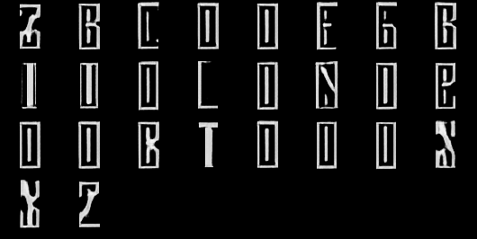
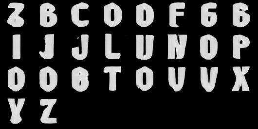
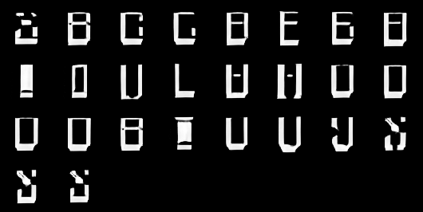
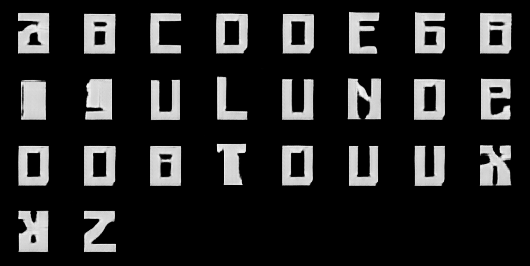

# Font generation using a style-consistent Generative Adversarial Network

## ✒️ Examples:
Gothgan Type            |  Comigan Type
:-------------------------:|:-------------------------:
  |  

Ikogan Type             |  Squaregan Type
:-------------------------:|:-------------------------:
  |  


## ❕ About...
## ... the model:
The model was created similar as proposed by Hayashi et al. in the paper [GlyphGAN: Style-Consistent Font Generation Based on Generative Adversarial Networks](https://arxiv.org/abs/1905.12502).

The model follows the Deep-Convolutional Generative Adversarial Network architecture. The generator produces 64x64 images containing one glyph. In order to generate glyphs with the same style over the entire alphabet, style-consistency has to be introduced. This is done by concantinating the random latent vector with a one-hot representation of a letter in the alphabet before feeding it into the generator. In order to generate a style-consistent alphabet the latent vector has to be the same for all letters.
The following code snippet shows how the input to the generator is created to generate 26 glyphs with the same style:
```python
one_hot_letter = F.one_hot(torch.tensor([idx for idx in range(26)]), num_classes=26)
font_noise = torch.randn(100).repeat(26, 1)
input_ = torch.cat((one_hot_letter, font_noise), dim=1).unsqueeze(2).unsqueeze(3).to(device=device)
```

### ...the dataset:
The dataset used was taken from the [deep-fonts](https://erikbern.com/2016/01/21/analyzing-50k-fonts-using-deep-neural-networks) creator and can be downloaded from Google Drive [here](https://drive.google.com/file/d/0B0GtwTQ6IF9AU3NOdzFzUWZ0aDQ/view?resourcekey=0-hJ4N66Y4_LeYPpnuLSvugw).
It conisist of 56443 fonts, each containing of 62 64x64 images. For this project only the first 26 glyphs where used (upper-case only letters).


## ⬇️ Installation:
1. install this repository:
```
git clone git@github.com:theopfr/font-generation-gan.git
```
2. install the following Python dependencies:
- Pytoch
- tqdm
- numpy
- matplotlib

## 📝 Generating fonts:
The glyphs generated by this model are often not ledgible or do not look like the actual letter they should represent. Yet there is a conistent style over all letters in the alphabet which can be used as inspiration for the typographer.

Reason for the semi-good results were lack of computational resources and time-pressure, therefore I endorse you to train it on your own machine and try out different hyperparameters.

To generate fonts using either the pre-trained ``dcgan-model`` or your own trained model, execute the [generate_font.py](generate_font.py) file with a flag naming the model directory:
```
python generate_font.py --model dcgan-model
```

The font will then appear in a file called ``fake_font.png`` inside the [./runs/dcgan-model/generated_fonts/](runs/dcgan-model/generated_fonts) folder file.

## 🏋️‍♀️ Training own model:
To train on your own, simple go into the [train.py](train.py) file, scroll down and give your model a name, for example ``my-model`` and the run the file:
```
python train.py
```

A folder with the name of your model will be created inside the [./run/](/runs/) directory. This folder contains:
- a folder called [models](/runs/dcgan-model/models/) which holds the model file for the generator and discriminator
- a folder called [result_images](/runs/dcgan-model/result_images/) which will be filled with generated images while the model trains in order to check process
- a folder called [generated_fonts](/runs/dcgan-model/generated_fonts/) in which the images of fonts generated by the [generate_font.py](./generate_font.py) file will land
- a file called [train_history.json](/runs/dcgan-model/train_history.json) which logs the generator loss, discriminator loss and the learning rate

